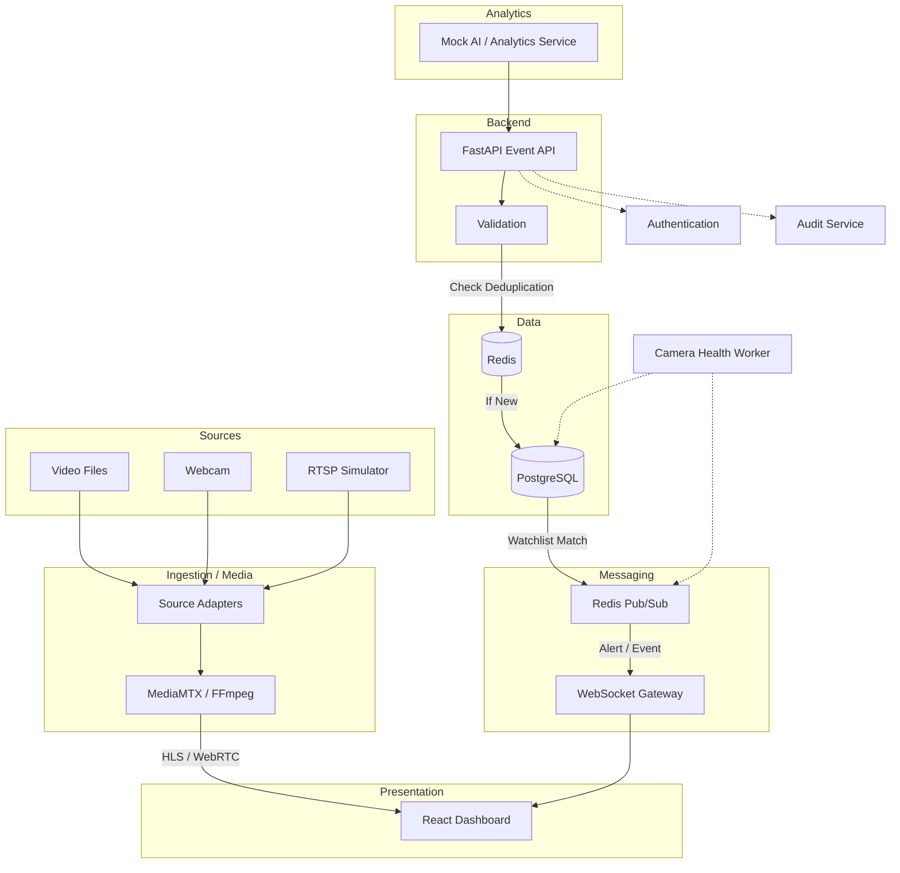

# Architecture

This document describes the logical layers and core components of the okdriver-cctv-platform.

## Logical Layers

### 1. Sources Layer
The origin of video streams.
- **Video files:** Pre-recorded videos for testing.
- **Webcam:** Live feed from a local camera.
- **RTSP simulator:** Simulated IP cameras.
- **ONVIF mock:** Simulated cameras with PTZ and metadata capabilities.
- **Vendor API mock:** Simulated proprietary camera systems.

### 2. Ingestion / Media Layer
Responsible for receiving and converting video streams for the web.
- **Source adapters:** Interfaces to connect to various camera types.
- **Media gateway:** Central point for stream management.
- **MediaMTX:** RTSP/RTMP/HLS/WebRTC server.
- **FFmpeg:** Video processing and transcoding.
- **HLS/WebRTC playback:** Formats served to the frontend.
- **Security Boundary:** The browser must NOT receive raw RTSP credentials. Stream credentials remain server-side.

### 3. Analytics Layer
Processes video for intelligent events.
- **Mock ANPR/analytics service:** Simulates AI detection.
- **Detection event generation:** Creates structured event payloads.
- **Future real AI model integration point:** Designed to seamlessly replace the mock service.

### 4. Backend Layer
The core business logic (FastAPI modules).
- **Authentication:** JWT-based user login and RBAC.
- **Camera registry:** CRUD operations for cameras.
- **Camera health:** Monitoring camera status (online/offline).
- **Events/detections:** Receiving and processing analytics events.
- **Watchlist:** Managing lists of entities of interest.
- **Alerts:** Generating notifications based on matches.
- **Search:** Querying historical events.
- **Vehicle/entity trace:** Tracking movement across cameras.
- **Statistics:** Aggregated data for dashboard.
- **Audit logs:** Tracking user actions.

### 5. Messaging Layer
Handles real-time communication and transient data (Redis).
- **Pub/Sub:** Distributing events across instances.
- **Event channel:** Real-time detections.
- **Alert channel:** Real-time notifications.
- **Camera health channel:** Real-time status updates.
- **Deduplication keys:** Preventing duplicate event processing.
- **Cache:** Storing frequently accessed data.
- **Rate limiting:** API protection.

### 6. Data Layer
Persistent storage (PostgreSQL).
- **Users:** System administrators and operators.
- **Cameras:** Metadata and configuration.
- **Camera health/history:** Status logs.
- **Detection events:** Stored ANPR data.
- **Watchlist:** Target entities.
- **Alerts:** Triggered notifications and their states.
- **Audit logs:** System activity history.

### 7. Presentation Layer
User interface (React dashboard).
- **Dashboard:** Overview and statistics.
- **Camera grid:** Live video monitoring.
- **Camera registry:** Management interface.
- **GIS/map:** Leaflet-based camera locations and traces.
- **Alerts:** Notification center.
- **Watchlist:** Management interface.
- **Search:** Query tools.
- **Vehicle trace:** Visualization of entity movement.
- **Audit views:** Log inspection.

---

## Architecture Diagram



---

## Core Event Flow

1. Analytics service sends a detection event to FastAPI.
2. FastAPI authenticates the analytics service.
3. FastAPI validates the event schema.
4. Backend computes an idempotency/deduplication key.
5. Redis is checked for duplicate events.
6. If duplicate, suppress the event.
7. If new, persist the detection event in PostgreSQL.
8. Normalize the vehicle number.
9. Search the indexed watchlist.
10. If a watchlist match exists, create an alert.
11. Apply alert cooldown/deduplication.
12. Publish the event to Redis Pub/Sub.
13. Publish alert information to Redis Pub/Sub.
14. WebSocket gateway pushes updates to connected operators.
15. React dashboard updates without page refresh.

### Camera Health Flow

```
Camera/source
    ↓
Heartbeat
    ↓
FastAPI
    ↓
camera health state
    ↓
PostgreSQL
    ↓
Redis Pub/Sub
    ↓
WebSocket
    ↓
Dashboard
```

**Camera states:**
- ONLINE
- OFFLINE
- DEGRADED

---

## Adapter Design

A common Source Adapter interface is used to abstract vendor-specific details.

```
SourceAdapter
    ├── FileAdapter
    ├── WebcamAdapter
    ├── RTSPAdapter
    ├── ONVIFAdapter
    └── VendorApiAdapter
```

**Why adapters are needed:**
Different camera vendors expose different protocols/interfaces. The rest of the backend should not depend directly on vendor-specific implementations, allowing for easy expansion and testing.

---

## Security Design

**Authentication:**
- JWT

**Authorization:**
- Admin
- Operator

**Admin can:**
- manage cameras
- manage watchlist
- view audit logs
- manage system configuration

**Operator can:**
- view cameras
- search entities
- view alerts
- acknowledge/resolve alerts according to permissions

**Security rules:**
- Never expose raw RTSP credentials to browser
- Stream credentials remain server-side
- Secrets stored through environment variables
- .env must not be committed
- .env.example contains only placeholders
- Validate all API input
- Rate limit sensitive APIs
- Authenticate analytics service
- Audit administrative actions
- HTTPS/TLS in production

---

## Future Scalability Blueprint

*Note: These are estimates/planning assumptions for scaling to ~80,000 cameras.*

**EDGE:**
- camera-adjacent processing
- stream pull
- motion/ANPR pre-filtering
- local buffering
- send metadata/snapshots instead of every stream centrally

**REGIONAL:**
- city/district VMS
- analytics clusters
- regional database
- short-term storage

**CENTRAL:**
- centralized registry
- global watchlist
- cross-region correlation
- command dashboard
- long-term archive

**Future Technologies:**
- Kafka for durable high-scale event streaming
- Kubernetes for orchestration
- Load balancing
- Horizontal API scaling
- WebSocket gateway scaling
- PostgreSQL partitioning
- Read replicas
- ClickHouse/TimescaleDB possibility for time-series data
- Object storage
- Hot/warm/cold storage tiers
- GPU/edge inference
- Comprehensive monitoring
- Disaster recovery

---

## Future Repository Structure

```
okdriver-cctv-platform/
│
├── backend/
│   ├── app/
│   │   ├── api/
│   │   ├── core/
│   │   ├── models/
│   │   ├── schemas/
│   │   ├── services/
│   │   ├── adapters/
│   │   ├── realtime/
│   │   ├── workers/
│   │   └── main.py
│   ├── alembic/
│   ├── tests/
│   ├── requirements.txt
│   └── Dockerfile
│
├── frontend/
│
├── simulator/
│
├── media/
│
├── docs/
│
├── docker-compose.yml
├── .env.example
├── .gitignore
└── README.md
```
