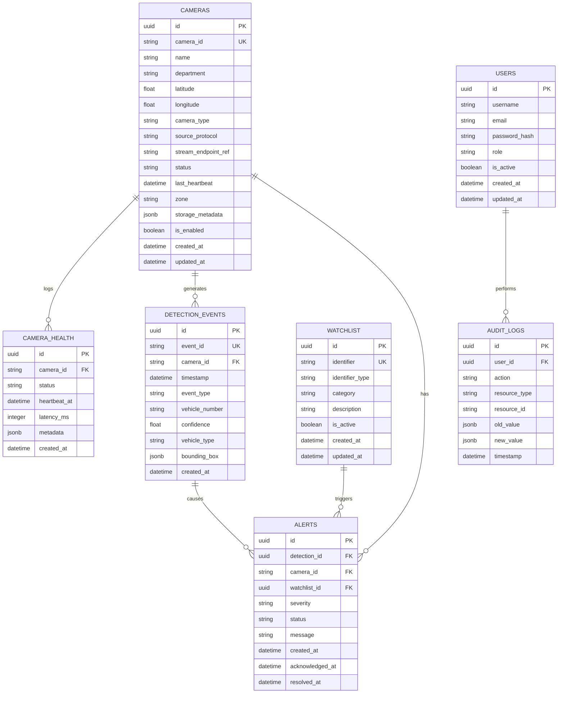

# Database Entity-Relationship Diagram

## Entities

### USERS
- id (PK)
- username
- email
- password_hash
- role
- is_active
- created_at
- updated_at

### CAMERAS
- id (PK)
- camera_id (Unique)
- name
- department
- latitude
- longitude
- camera_type
- source_protocol
- stream_endpoint_ref
- status
- last_heartbeat
- zone
- storage_metadata
- is_enabled
- created_at
- updated_at

### CAMERA_HEALTH
- id (PK)
- camera_id (FK -> CAMERAS.camera_id)
- status
- heartbeat_at
- latency_ms
- metadata
- created_at

### DETECTION_EVENTS
- id (PK)
- event_id (Unique)
- camera_id (FK -> CAMERAS.camera_id)
- timestamp
- event_type
- vehicle_number
- confidence
- vehicle_type
- bounding_box
- created_at

### WATCHLIST
- id (PK)
- identifier (Unique with type)
- identifier_type
- category
- description
- is_active
- created_at
- updated_at

### ALERTS
- id (PK)
- detection_id (FK -> DETECTION_EVENTS.id)
- camera_id (FK -> CAMERAS.camera_id)
- watchlist_id (FK -> WATCHLIST.id)
- severity
- status
- message
- created_at
- acknowledged_at
- resolved_at

### AUDIT_LOGS
- id (PK)
- user_id (FK -> USERS.id)
- action
- resource_type
- resource_id
- old_value
- new_value
- timestamp

## Relationships
- **CAMERAS (1) to (N) CAMERA_HEALTH**
- **CAMERAS (1) to (N) DETECTION_EVENTS**
- **CAMERAS (1) to (N) ALERTS**
- **WATCHLIST (1) to (N) ALERTS**
- **DETECTION_EVENTS (1) to (N) ALERTS**
- **USERS (1) to (N) AUDIT_LOGS**

## Important Indexes
- `camera_id` + `timestamp` (for fast time-series queries on events/health)
- `vehicle_number` + `timestamp` (for vehicle trace search)
- `identifier` (Watchlist lookups)
- `status` + `created_at` (Alerts queue)
- `status` (Cameras)
- `event_id` (Unique constraint for deduplication)

## ER Diagram

